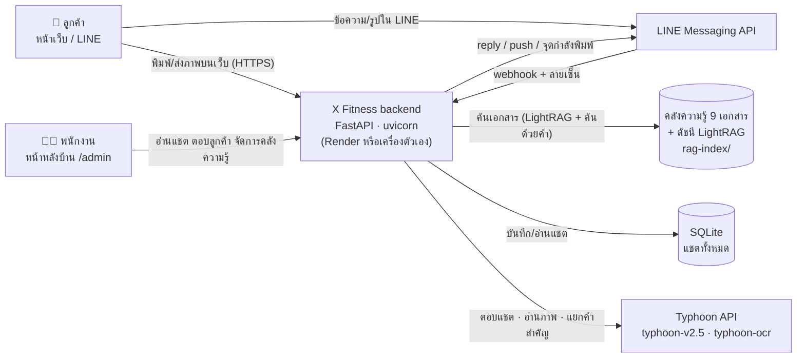
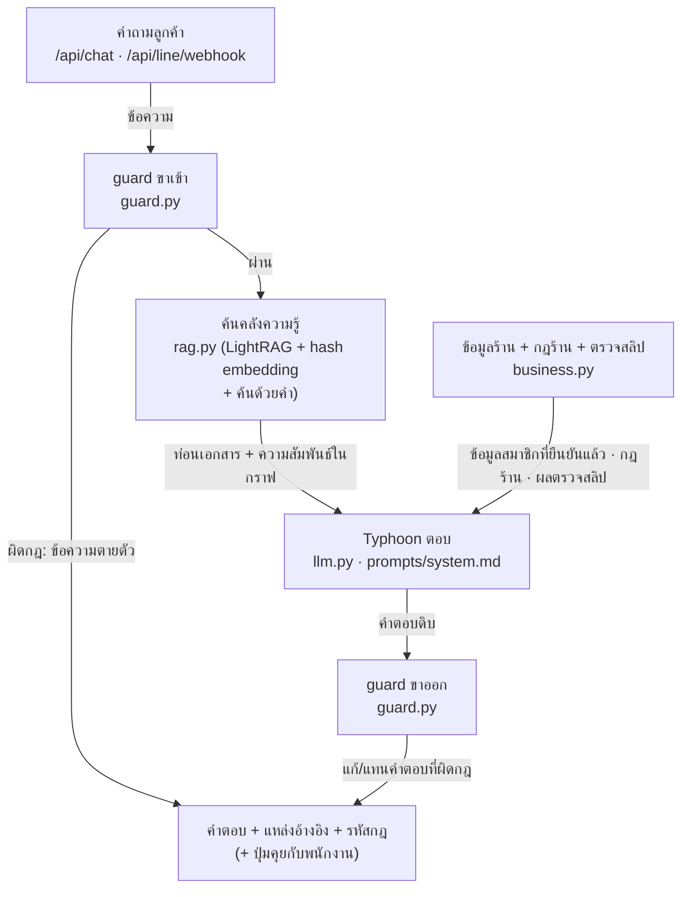
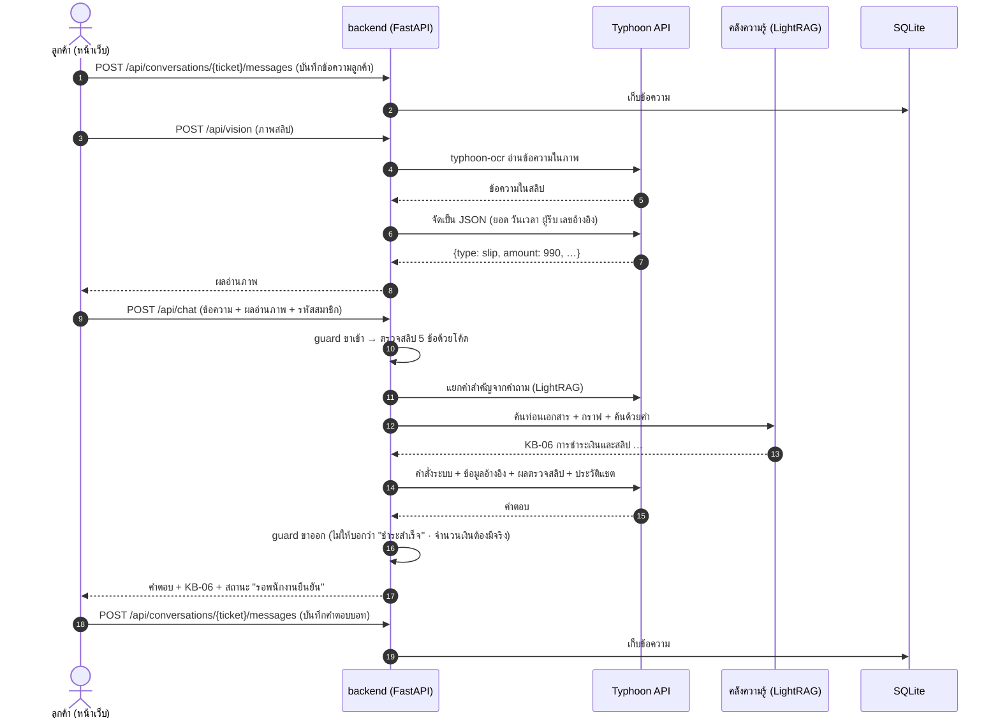

# X Fitness Chatbot — แผนภาพสถาปัตยกรรมและการไหลของข้อมูล

> ผู้พัฒนา: 68076040 เบญจมาภรณ์ เจียนเกาะ · 68076065 สรรเสริญ มากเจริญ · ฉบับ 4 ต.ค. 2569 · โค้ดอยู่ที่ `x-fitness/` · แผนภาพเขียนด้วย Mermaid (เปิดใน GitHub หรือ VS Code แล้วเห็นเป็นภาพ)

## แผนภาพที่ 1 — สถาปัตยกรรมระบบ

แอปเดียว (FastAPI) รับทั้งหน้าเว็บ หลังบ้าน และ LINE · ความฉลาดมาจาก Typhoon ผ่าน API · ความรู้ของร้านอยู่ในไฟล์ที่ commit มากับโค้ด

## แผนภาพที่ 2 — ส่วนประกอบภายใน backend

## แผนภาพที่ 3 — การไหลของข้อมูล 1 ข้อความ (ลูกค้าส่งสลิปบนหน้าเว็บ)

ทาง LINE ใช้ขั้นตอนเดียวกัน ต่างแค่ข้อความเข้าทาง `POST /api/line/webhook` (ตรวจลายเซ็น ตอบ 200 ทันที แล้วทำงานเบื้องหลัง) ภาพโหลดจาก LINE แทนการอัปโหลด และคำตอบส่งกลับด้วย reply API ของ LINE

## Endpoint ทั้งหมดในแผนภาพ

| # | Method · Path | ใครเรียก | ทำอะไร | ทดสอบที่ |
|---|---|---|---|---|
| 1 | GET `/api/health` | หน้าเว็บ · Render | สถานะระบบ โมเดล ตัวค้น LINE เปิดไหม | `tests/test_conversations.py` |
| 2 | POST `/api/chat` | หน้าเว็บ | บอทตอบ (guard → RAG → Typhoon → guard) | `tests/test_bot.py` · `eval/run.py` |
| 3 | POST `/api/vision` | หน้าเว็บ | อ่านภาพ → JSON | `tests/test_bot.py` · `eval/run.py` |
| 4 | GET `/api/conversations/{ticket}` | หน้าเว็บ | ลูกค้าดึงแชตของตัวเอง | `tests/test_conversations.py` |
| 5 | POST `/api/conversations/{ticket}/messages` | หน้าเว็บ | บันทึกข้อความลูกค้า/บอท | `tests/test_conversations.py` |
| 6 | POST `/api/conversations/{ticket}/handoff` | หน้าเว็บ | ขอคุยกับพนักงาน | `tests/test_conversations.py` |
| 7 | POST `/api/admin/login` | หลังบ้าน | ล็อกอินได้ token | `tests/test_conversations.py` |
| 8 | GET `/api/admin/conversations` | หลังบ้าน | รายการแชตทั้งหมด (เว็บ + LINE) | `tests/test_conversations.py` |
| 9 | POST `/api/admin/conversations/{ticket}/messages` | หลังบ้าน | พนักงานตอบ (แชต LINE ส่งเข้า LINE ด้วย) | `tests/test_conversations.py` · `tests/test_line.py` |
| 10 | PATCH `/api/admin/conversations/{ticket}` | หลังบ้าน | รับเรื่อง / ปิดเรื่อง / อ่านแล้ว | `tests/test_conversations.py` |
| 11 | DELETE `/api/admin/conversations/{ticket}` | หลังบ้าน | ลบแชต | `tests/test_conversations.py` |
| 12 | DELETE `/api/admin/conversations` | หลังบ้าน | ลบแชตทั้งหมด | `tests/test_conversations.py` |
| 13 | GET `/api/admin/kb` | หลังบ้าน | รายการเอกสารและสถานะดัชนี | `tests/test_knowledge.py` |
| 14 | POST `/api/admin/kb/search` | หลังบ้าน | ทดสอบค้นคลังความรู้ | `tests/test_knowledge.py` |
| 15 | POST `/api/admin/kb` | หลังบ้าน | อัปโหลดเอกสาร .md | `tests/test_knowledge.py` |
| 16 | POST `/api/admin/kb/reindex` | หลังบ้าน | สร้างดัชนีใหม่เฉพาะที่เปลี่ยน | `tests/test_knowledge.py` |
| 17 | POST `/api/line/webhook` | LINE | รับข้อความ/รูปจาก LINE | `tests/test_line.py` |

รัน test ทั้งชุด (ไม่ต้องใช้ key): `cd x-fitness/backend && python -m pytest`
